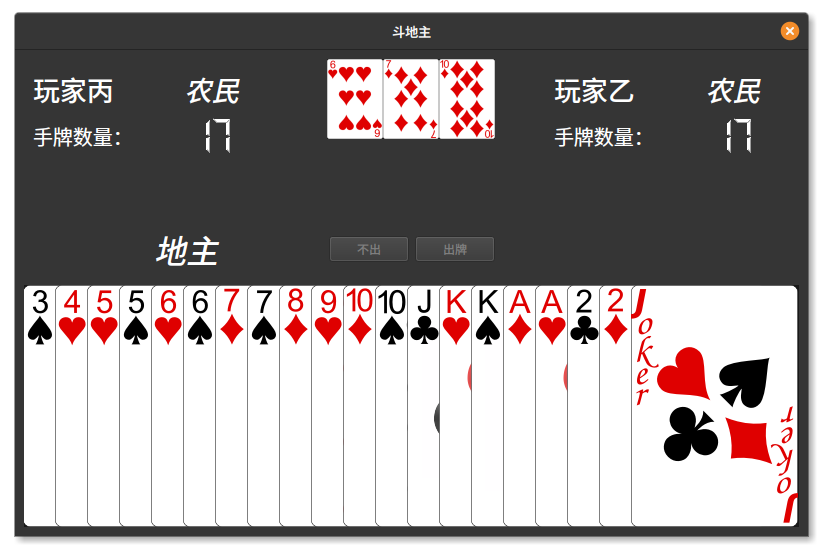

# DDZ
Doudizhu(斗地主), a Chinese card game implemented in QT for THU CS Y1 Summer school programming module.
Rules of the game strictly follow the ones listed on [Wikipedia](https://en.wikipedia.org/wiki/Dou_dizhu).

It has network capabilities, allowing for multiplayer over 3 different instances.

Translation files are provided as well, it is possible to run the game in both English and Chinese.
